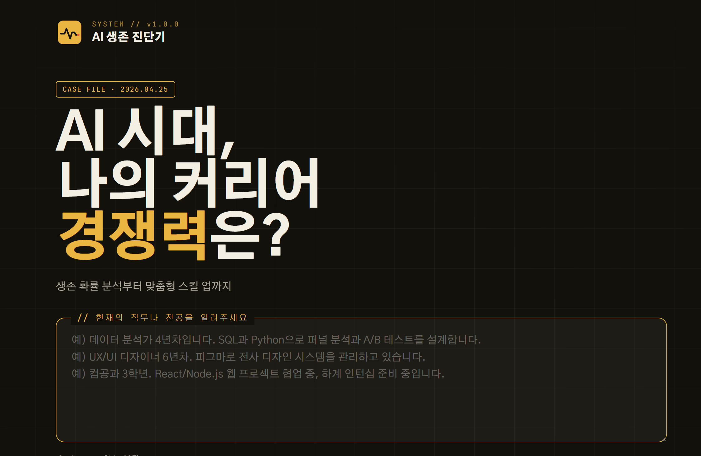
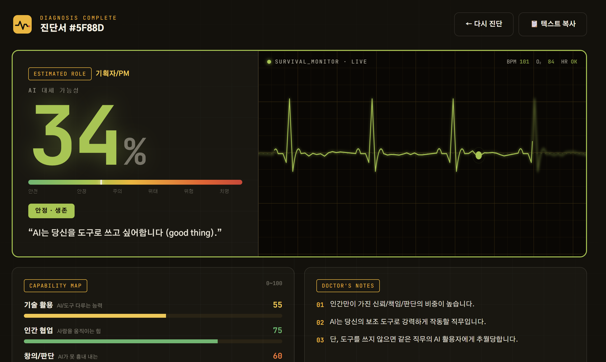

# AI 생존 진단기

🔗 **[https://vibe-bluebird.vercel.app](https://vibe-bluebird.vercel.app)**





> **"AI가 당신을 대체할 확률은 몇 %일까요?"**  
> 직무와 경력을 자연어로 입력하면, Gemini AI가 대체 가능성과 맞춤형 생존 전략을 즉시 분석해드립니다.

**Flutter Seoul Meetup 바이브코딩 해커톤 2026 출품작 · 팀 파랑새**

---

## 왜 만들었나요?

2026년, AI 에이전트 확산과 대기업 구조조정으로 **"내 일자리 괜찮을까?"** 라는 불안이 최고조에 달했습니다.

하지만 유튜브 영상은 너무 일반적이고, 블로그는 내 직무에 안 맞고, ChatGPT에 물어보면 형식도 없습니다.

> **"불안은 구체적인데, 해결책은 추상적이다."**

AI 생존 진단기는 자연어 입력 하나로 **나에게 맞는 답을 30초 안에** 내놓습니다.

| | |
|---|---|
| **타겟** | AI 영향이 걱정되는 2030 직장인·취준생 |
| **핵심 가치** | 막연한 공포 → 오늘 당장 할 수 있는 행동으로 |
| **형태** | 설치 없이 브라우저에서 바로 실행 |

---

## 화면 흐름

```
[index.html] 자연어 입력
      ↓
[loading.html] Gemini AI 분석 중
      ↓
[result.html] 진단 결과 카드
```

### Scene 1 — 입력
- 직무·경력을 자유롭게 자연어로 입력
- 직군별 예시 프롬프트 칩으로 빠른 시작
- 개인 Gemini API 키 입력 (브라우저에만 저장, 서버 미전송)

### Scene 2 — 분석 중
- AI 스캐닝 애니메이션
- "직무 분석 중..." → "AI 위협 지수 계산 중..." → "생존 전략 수립 중..."

### Scene 3 — 결과
- 🔴 **AI 대체 가능성 n%** — 게이지 시각화
- 🛠 **살아남는 스킬 로드맵** — 1개월 → 3개월 → 6개월 단계별
- 🤖 **지금 당장 써야 할 AI 도구** — 직무 맞춤 추천

---

## AI 활용

| 역할 | 도구 |
|---|---|
| **기획 및 시장조사** | Claude |
| **UI 목업** | Claude Design |
| **코드 개발** | Claude Code |
| **직무 분석 엔진** | Gemini API |
| **문구 및 콘텐츠 다듬기** | Gemini |

---

## 기술 스택

| | |
|---|---|
| **프레임워크** | React 18 (CDN, 빌드 없음) |
| **AI** | Gemini API |
| **스타일** | CSS Variables + 인라인 스타일 |
| **번들러** | Babel Standalone (브라우저 직접 트랜스파일) |

---

## To-Do

- [ ] 스킬 트리 항목에 학습 리소스 링크 연결
- [ ] 결과 페이지 PDF 다운로드 기능
- [ ] 실행 플레이북 리마인더 및 체크리스트 기능
- [ ] **수익화 모델** — 맞춤형 진단 결과에 연계한 AI 툴 · 교육 플랫폼 제휴 (Affiliate, B2B 스폰서십)

---

## 로컬 실행

빌드 없이 정적 서버만 있으면 됩니다.

```bash
# Python
python -m http.server 8080

# Node.js
npx serve .
```

---

## 팀 파랑새

| | |
|---|---|
| [@yha992](https://github.com/yha992) | [@KIMSG](https://github.com/KIMSG) |

Flutter Seoul Meetup 바이브코딩 해커톤 2026
